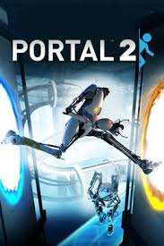

***
# **Miles Cutting - Assesment Task 3 - Part B - Portfolio - The Final Fragment**

## Identifying and Defining:

Brainstorming:
 - RPG
 - Adventure Game
 - Local Multiplayer
 - Controller Support
 - Boss Levels
 - Mini-Bosses
 - Difficulty Progression
 - Fantasy
 - 2.5D

General Introduction/Game Idea/Story:

The player is exploring a world new to them in search for pieces of a lost sword. They where broken up and placed behind a series of challenges thousands of years ago to protect the world from their power. Only the bravest heros have sought after the sword. Recently, a new power has risen in your country and enslaved your friends and family. The only way to stop them is with the power of the sword. You set off on your quest to retrieve the pieces and save what is close to you.

***

Identify a Need:

Need:
A story rich and highly interactive game that will help develop people of all ages cordination, problem solving, and cognitive thinking. 

Problem Statement:
People of all ages have room to improve their thinking, reaction times, and fine motor skills, however, most often lack the time. My focus for this game is to give people an option to relax that also develops these key skills. My game is a 2.5D platformer (3D graphics locked to a 2D view such as the new mario bros or ori) where the player is trynig to obtain a fragment of a sword by beating ememies, which which will develop peoples cordination, quick thinking, and reaction times. They will have parkour to do which will develop their fine motor skills to control the character. They will also be using cognitive thinking to solve problem in the the game as a way to progress.

Skill Development:
To create this project, I will need to develop a range of skills. To develop these skills, I can use the skills I have learnt from part A, such as how to design and add levels into unity, and I can use a range of free tutorials to learn how to add features such as an inventory system, a health system, and a ememy system. I will also need to learn more general skills to make the game such as file secutity and how to encrypt and decrypt files for storing data.

***

Requirements Outline:

Inputs:
 - Keyboard Inputs - W, A, S, D, Space, Arrow Keys
 - Mouse Inputs - Clicks, Cursor Location
 - Controller Inputs - Left Stick, Right Stick, Up, Down, Left, Right ...

Example:
The users will use a keyboard to control where the player moves throughout the levels, where and how they interact with items in the level. A mouse will be used to interact with features in the game such as with the inventory or trading menus.

Proccessing:
 - Movement Calculations
 - Currency/Item Calculations

Example:
As the player progresses through the level, it will calculate where the player is, what the player is colliding and interactung with, and when and how they are using items. An example of this is calaulating the process of buying and selling items within the game.

Outputs:
 - Screen Updates
    - Player Movement - The Player moving from one part of a level to another
    - Inventory Updating - Items from inventories being removed and added based on what the player is doing
    - Action/Event Display - Events such enemies and obstacles becomeing seen on the screen and making their actions clear

 - Sounds 
    - Interactive Noises - When the player collets an item or getting a power up, they will have auditory feedback while it is happening
    - Voice Acting - To keep the story engaging, any part of the story that can't be conveyed with events and movements, voices will be used rather then text

 - Menu's and Screens
    - Start Menu - The player will interact with this screen to choose different save accounts, do level selection, tweak settings, and start the game
    - Game Over - When the player loses, a game over message or screen will show up which will allow the player to choose what they want to do
    - Pause Menu - Because my game will be single player, their will be a pause menu for the player when they need to take a break. It will also allow them to access the settings menu which will allow them to tweak settings mid game.

Transmission:
 - Multiplayer - My game will support local multiplayer which will mean their will be no need for information to be transmitted between computers.
 - Player Accounts - Player accounts will be saved in a easy to find location (which will be configurable) in the game files. This will mean as people want to switch between devices with their account and progress by using removable drives such as USB drives.

Storage:
 - Game Files (Non-Configurable) - All of the game files will be stored locally and together. Example: Unity Files, Game Art/Assests
 - Game Files (Configurable) - Game files that are configurable such as the account settings, and account progress will be stored by default as a sperate folder within the game files, but will have to option to change the location to allow for quick and easy multi-device playing. The use of all local storage will also improve the overall cyber security of my game.

***

Functional Requirements:

User Interaction:

Keyboard:
Input: Keyboard Commands (W, A, S, D, Space, Arrow Keys)
Use: Player Movement
Output: The player moves throughout the level interacting with obstacles
Example: The player clicks 'D', and the player on screen moves right along the level until it reaches a obstacle, such as a wall the player will need to jump over, or something that does damage to the player.

Mouse:
Input: Mouse Input (Cursor Location, Left Click, Right Click, Scroll, Middle Click)
Use: Interaction with Mouse
Output: The player will use the mouse to interact with menus in the game such as the inventory system, pause menu, start menu, or game over screen
Example: The player selects an item they want from a shop by left clicking on the item, then left clicking on the purchase button. This will remove X amount of gold the item costed, and will put the purchased item in their inventory.

Core Gameplay:

**Movement:**

Player inputs a movement Command (W, A, S, D, Space, Arrow Keys)

V

Game Checks for collision with the level such as a wall or obstacles

V

If: The Player hits a wall, then stop

Else If: If the player hits an obstacle, run damage script

Else: Move In the direction based off of what key was pressed

**Inventory:**

Player imputs a hotkey for an inventory item (1-7)

V

Runs Script for the item the player selected i.e Uses potion and the player gain an effect, Uses food an the player gains hunger/food points

**Battle:**

Player clicks a hotkey for a weapon i.e Sword, Axe, Bow, Damage potion

V

If: Weapon is shortrange - Extend a extra hitbox from the player model which damages others in its range, starts cooldown for weapon

Else If: Weapon is Long Range - Launch a hitbox from the player to a distance which deals damage if it hits others, starts cooldown, removes the shot item i.e Loses 1 arrow, Loses the potion thrown

Scoring and Feedback:
While my game wont have a score, their will be a health level and stamina level the player will need to maintain to progress throug hthe game. While the player is in combat, the player will experience feedback on enemy attacks and hits. During combat, the player will also need to focus on their stamina bar to see what attacks they have avalible to them, and how many times they can use them. An example of how this works is the player may start a combat interaction with 15/15 heath and 15/15 stamina. The first attack from the enemy might do 3 hit points of damage leaving them with 12/15 points of health. Then they player will attack the enemy with a mid level attack, this may use 4 points of stamina leaving them with 11/15 and damage the enemy. Over time, the player will heal and regain stamina. Their will also be a range of other systems in place to provide the player with feedback based on what is happening in the game, this includes sound effects, and visual cues.

Level Progression:
In each level, the player will be trying to obtain a fragment of a sword, once they obtain all of them, they will use the sword to defeat a final boss. The fragments that are easier to obtain will be the earlier levels to allow the players o understand the movement, mechanics, and feature of the game, before they start to preform harder challenges and obstacles in the later levels. Once the player has obtained one of the fragments, they will be grought back to the main screen where and animation will play making it clear to the player they have completed the level, and they can move onto the next. Players won't be able to progress to the next level until they have beaten the level prior to it. The boss level will use all of the skills the player will have developed.

Saving and Loading Data:
My game will store user data locally, with a basic level of encryption, and a user login consisting of a username and password. It will save it in a easy to access locaiton however so the player can easily put it on a USB drive for example, to maintain the same account accross a range of devices.

***

Non-Functional Requirements:

Peformace Requirements:
For a low to mid range laptop, the game should load onto the start menu in under 20 seconds. The inputs should feel responsive with instant feedback shown in the game. The responsive movements should be maintained even during computing intensive events such as boss fights or other events with numerous calaculations.

Usability Requirements:
The UI will make sense with simple text labels such as "Start", "Options", or "Quit" on the Start menu, and text labels such as "Buy" and "Sell" in the shop menus. In the bottom left corner of the start menu, their will be a icon which will run through how to start the game, how to chose levels, how to move, and other key mechanics. After the tutorials has ran, a setting will be toggled so it doesn't show up on the main menu again unless manually changed in the settings (Which will be made clear at the end of the tutorial that this has happened) to keep the UI simple. Other indicators such as where to go will be part of the game. An example of this is a clear progression of levels for where the player has to go by having the next couple of key points always visable from where the player is at any moment.

Compatability Requirements:
My game will be built and designed around running on Windows computers, with Keyboard and Mouse as the controls. I will also design the game to work well with a controller without having any loss of difficulty or enjoyment, regardless of what control system they want to use. I've chosen to build my game around Windows rather than other platforms for a few main reasons. The first is I personally am running windows which will allow my to test and validate my game natively. The next reason is nearly all of the other major operating systems, (MacOS and Linux) support a compatability or translation layer to allow native windows applications to run on the other opperating systems. (such as WINE, Proton, or Rossetta) The final reason for focusing on Windows is that over 70% of computers world wide run windows so it will allow me to give the best experience to the most people possible. I have chosen not to focus on mobile, I don't think I would be able to effectivly make a control system for it, and still be able to deliver on my other criteria.

Security Requirements:
My game is designed to run completly offine, and collect no sensative user data. Progress and settings will be stored in a encrypted file stored locally to protect user information. Their will also be a simple username and password system that is encrypted in the save file to ensure that the person accessing it is someone with permission to access it.

Reliability and Availabilty:
Their will be few variables that can impact the reliability and availabilty of my game because it doesn't use online access or other services. This means with effective play testing and validation of my game running on a range of systems, their will be no down time of the game for almost everyone who runs it. With these systems in place, their are still factors which will impact the reliability and availabilty of my game. Examples of these are force quits, or power loss. To prevent loss of progress for the player, I can impliment Autosave features into the game which will prevent as much data loss as possible. These will by default run every 5 minutes, but can be changed depending on how often the player wants them to run, i.e Never to every 1 minute. Their will also be a manual save feature for the players so they can save their progress without any data loss from when they close the game.

***

Consideration of Social and Ethical Issues:

Define the Terms:
Equity - The quality of being fair and ensuring every participant equally. 
Accessibility - The quality of being achieveable, reached, or obtained by anyone, regardless of limitations.

Accessability:
Their is a range of features and tools I can impliment into my game to allow it to be more accessable to a wider range of people. These tool can range from subtitles to entirely new contol methods. To ensure anyone is able to play my game regardless of physical abilities, the control system will be completelty customisable to work with any input such as controllers designed specifically for limited movement. By implimenting togglable subtitles for my game, it will allow the story of the game to be understood and enjoyed by everyone. Other adjustments will be able to be toggled on such as the colours for the game. Their will be a range of presets and options to allow the visual aesthetic and colours to be tweaked all depending on the user. These features all together will allow my game to be played and enjoyed by everyone regardless of their abilities.

Privacy and Data Protection:
My game will store data such as user settings, preferences, and level progression. To ensure this data stays safe, it will all be stored locally on the device it is installed on, and it will be encrypted and have a username and password protection. This means that even if someone gains access to the file, they will still need the login to obtain any information from it.

Fairness and Representation:
To avoid any steriotypes and bias's, my game will use mythical characters without any race or culture. This will also help establish the theme of my game as an adventure, exploring a world the player has never seen before.

Mental and Emotional Well-Being:
Meantal Health won't be affected while the player plays my game because their is no content or material that could affect their mental health such as graphical violence.

Cultural Sensitivities:
My game wont have any areas that might be taken as culturally insensitive because the theme and style will be fantasy. This means their wont be any connections or relations to any cultures. 

***

## Reasearch and Planing

PMI Tables:
|Existing Ideas|Plus|Minus|Implication|
|--|--|--|--|
|The Binding of Isaac|The game is very difficult but manageable, which makes it both challenging but not too much to put you off. The game also has a lot of random aspects to it which makes every game feel similar but unique.|The controls are limited which makes movement and attacking difficult to do precisely. Some of the characters are unoriginal, often being the same with a different shade/colour over the top of them.|Having a large randomness aspect in my game will make it very fun and more inline with my adventure style game I want to make. It also allows for the game to more easily be made harder for experienced players and easier for new players by adjusting what rooms are more and less likely to appear or be used.|
|Ori, the Blind Forest|This game is beautiful with an amazing atmosphere while the player is traversing through the level. The style of 2.5D also elevates the entire experience of the game. The story is also amazing which if the player can get into, will provide one of the best stories of video games.|The start of Ori is quite long and some of the features aren’t immediately obvious. This means that for new players that want lots of short sessions, it is a hard game to do it with.|The story of my game will be made of a variety of small quests, stories, and adventures. This means that for players that want a big story and play for hours at a time, they are still getting that, but players that aren’t, are still getting a full experience.|
|Portal|Portal and Portal 2 have amazing puzzles to solve and has a difficulty that progresses at a great rate to both ease players into the game, and keep them on their toes. The story is great with a clear end objective and way to achieve it.|The entire game is quite short and once it has been beaten, there isn’t really a reason to play it again. There are also some key pieces of information that are easy to miss and often aren’t reiterated in the game.|My game will implement the good progression system, and, by using the randomness system from The Binding of Isaac it will make my game much more enjoyable to replay and it will eliminate the fact that it is too short because it can be played again.|

***

Flowchart and Pseudocode:

***

Function Battle

   Input Hotkey for Attack Item (1-7)

      If Hotkey Item is an Attack item

         If Attack Item is Short Range

               Output Extend a Hitbox off of the player which deals damage to anything in it

         Else

               Output Sends out a hitbox from the player (Speed, Size, and Distance Depends on the item thrown) and deals damage to anything touching it

               Output Removes Item from inventory that was thrown i.e Arrow, Potion

         End

         Output Starts Attack Cooldown

      End

End

***

Function Beating Levels

   Player Spawns into the Level

    If Is Level a Puzzle Level

        If Player Completes Puzzle

            Output Open Door With End Goal Behind it

        End

    Else

      Player Advances through the Level Until Reaching the Final Goal

    End

    If Player is touching End Goal i.e A fragment of the sword

        Output Level X is Beaten, Level X+1 is Unlocked

        If Start Next Level

            Output Start X+1 Level

        Else

            Output Return to Splashscreen

        End

    End

End

***

Function Hotkeys

    Input X (Number Key 1-7) is Pressed

    If X Item has a Script/Action/Effect

        Output Run X Script/Action/Effect

    End

End

***

Function Movement

    If Player Input = "w" or Space or Up Arrow

        If There is Obstacle

            Player Hits Obtacle and Doesnt Do Action

        Else

            If Is Player on the Ground

                Output Player Jumps

            End

        End

    Else

        If Player Input = "A" or Left Arrow

            If There is Obstacle

               Player Hits Obtacle and Doesnt Do Action

            Else

                Output Player Moves Left

            End

        Else

            If Player Input = "D" or Right Arrow

                If There is Obstacle

                    Player Hits Obtacle and Doesnt Do Action

                Else

                    Output Player Moves Right

                End

            Else

                If Player Input = "S" or Down Arrow

                    Output Player Crouches

                End

            End

        End

    End

End

***

Function Splashscreen

    While Player Has Beaten Level X

        Output Unlock Level X in Level Select

        Output X = X+1

    End

End

***

Storyboards:

Flowchart:

Game Splashscreen:

|Assets|Code|Animations|
|--|--|--|
| - Background Image - Play Button - Quit Button - Options Button - Level Select (The Sword on the Right - Their is a system for it as the player collects parts of the sword but once they collect all of them, it will look like this for them to enter the final boss fight)|Play Button - (Script) Load the Highest Level unlocked in scene / Quit Button - (Script) Quits the application / Options Button - (Script) Open the Options Scene / Level Select - (Script) Run the scene for the selected level|Everything flys of the screen in a range of directions, the screen darkens to black, then lightens to the chosen scene.|

Inventory Screen:

*The Text in the inventory will be replaced with item icons for the final version

|Assets|Code|Animations|
|--|--|--|
| - Background Image - Invertory Icons/Slots - Quit Button - Options Button - Back Button|Inventory Slots - Displays the type of items in the players inventory with an icon and a counter for the quantity. If the player hovers the mouse over it, they get a name of the item and a short description. / Quit Button - (Script) Quits the application / Options Button - (Script) Open the Options Scene / Back Buttons - (Script) Loads back to where the player was when they selected the inventory button|The screen darkens and illuminates between the inventory screen and the level screen when the button is pressed.|

Concept Level:

|Assets|Code|
|--|--|
|Game Level/Assests i.e Player Model, Level Model - Puzzle - Puzzle Controls i.e <-, ->, ^, V Buttons|Player + Level Models - (3D Model) / Puzzle - (Level) The challenge for the player to complete by interacting with other parts of the level, once it is completed, a path to the end goal opens up. / Puzzle Buttons - (Level Buttons) The player will use these buttons built into the level to interact with the puzzle. This is a similar system that is seen in many other games (Notably this is used quite a bit in Skyrim and greatly increases the engagement and immersion of the game)|

Gantt Chart:

Red: Milestone for completing each area.

Dark Blue Days: Days which we have time in class.

This is a rough guide for what I want to be done when I want it to be done with the idea that anything I am not able to complete in class time will be done for homework.